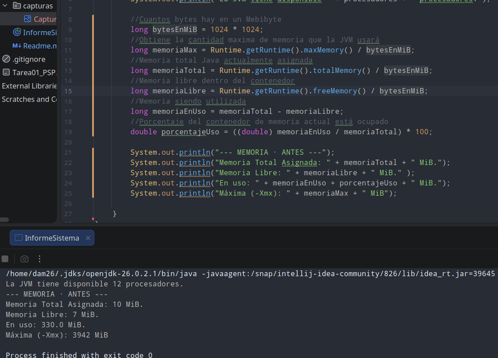
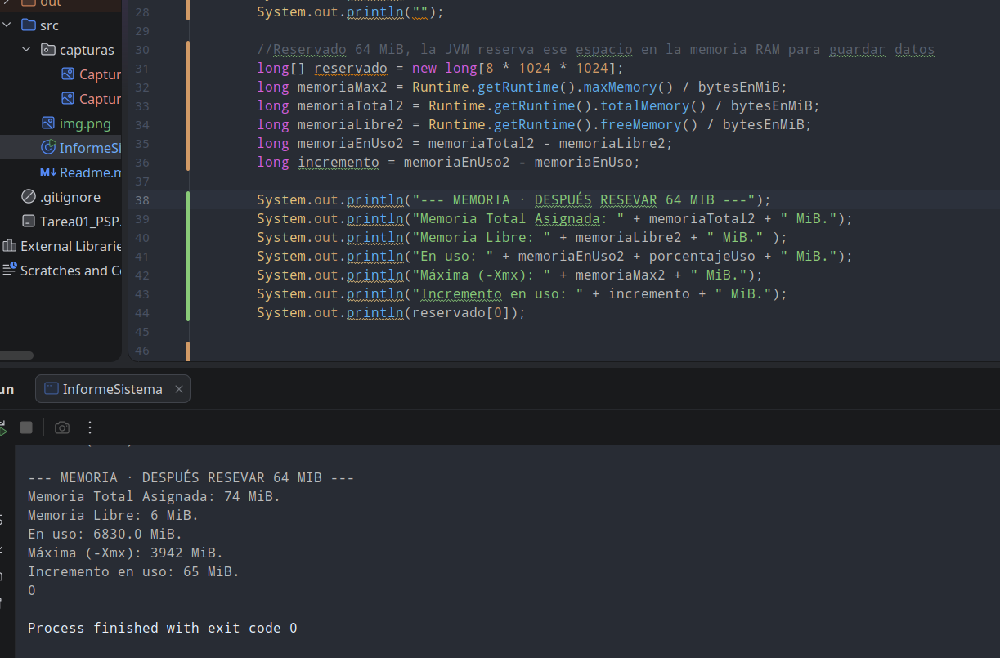
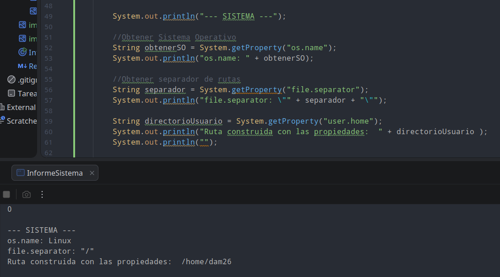
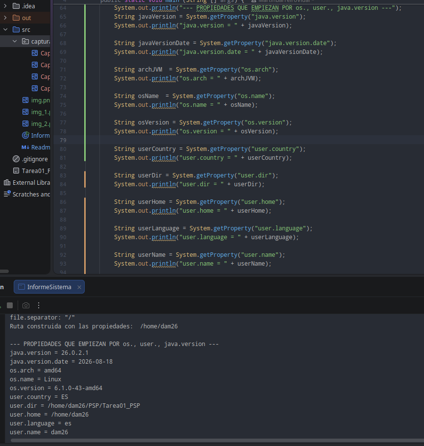
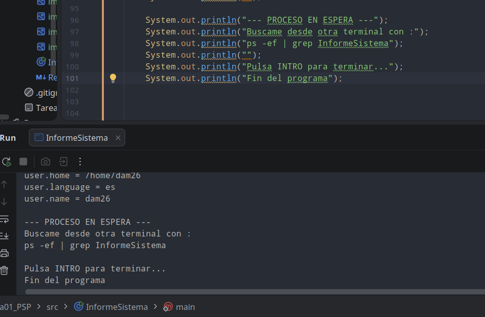

### 1.1 Procesadores: Nº de Procesadores disponibles para la JVM:

### 1.2 y 1.3 Memoria: total, libre, reservada, máxima y porcentaje:

### Reservar 64 MiB: medir, mostrar incremento memoria en uso:

### 1.5 y 1.6 Multiplataforma: Lo que está ejecutando y el separador de rutas.

### 1.7 Propiedades del Sistema:

### 1.8 Proceso en Espera: 

### 2 El Proceso desde Fuera (PROCESO EN ESPERA):

PID: 15443

PPID: 12757

El proceso padre con PPID 12757 corresponde al ejecutor interno del IDE.

### 2.1 El Proceso desde Fuera (PROCESO TERMINADO):

PPID: 12757 IntellJ

PPID: 15829 Terminal

El PPID cambia entre ejecuciones porque el origen del proceso es distinto: al lanzar la aplicación desde el IntelliJ, el proceso padre es el IDE (PPID 12757).

En cambio al lanzarla desde la terminal, el proceso padre pasa a ser el intérprete de comandos bash (PPID 15829).

### 3. Qué Tipo de Programación Encaja
#### a) Servidor web con 500 peticiones en máquina de 8 núcleos:
Tipo: Concurrente y Paralela.

Es concurrente porque gestiona cientos de peticiones intercalando tareas, y paralela al repartirlas físicamente entre los 8 núcleos.

El inconveniente es la sobrecarga a la CPU por tanto cambio de contexto entre hilos.

#### b) Renderizar una película en 3 meses:

Tipo: Distribuida.

Requiere una granja de servidores en red trabajando a la vez para no tardar años en una sola máquina.

El inconveniente es el cuello de botella al mover archivos pesados por la red y gestionar si algún equipo falla a mitad de trabajo

#### c) App de móvil que descarga un fichero mientras seguís navegando:

Tipo: Concurrente.  

Separa la descarga en un hilo secundario para que la pantalla no se congele y siga respondiendo a los toques del usuario.

Da fallos si intentas actualizar la pantalla directamente desde el hilo secundario.

#### d)  Un cálculo que no cabe en la RAM de un solo equipo.

Tipo: Distribuida.   

Como el volumen de datos no cabe en la memoria física de un equipo, hay que partirlo entre las RAMs de varios ordenadores.

La latencia de la red al pasarse mensajes de un nodo a otro ralentiza bastante el proceso respecto a la RAM local.

